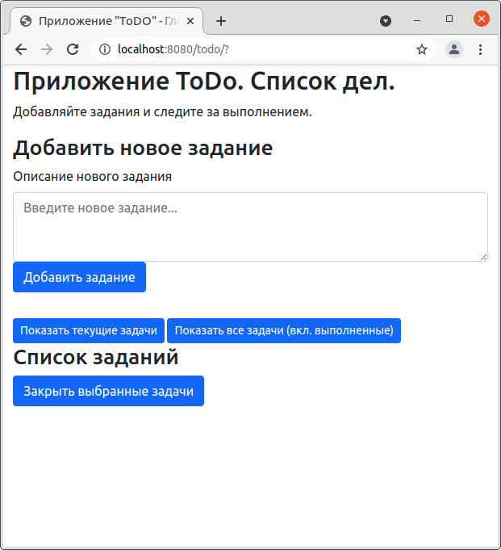
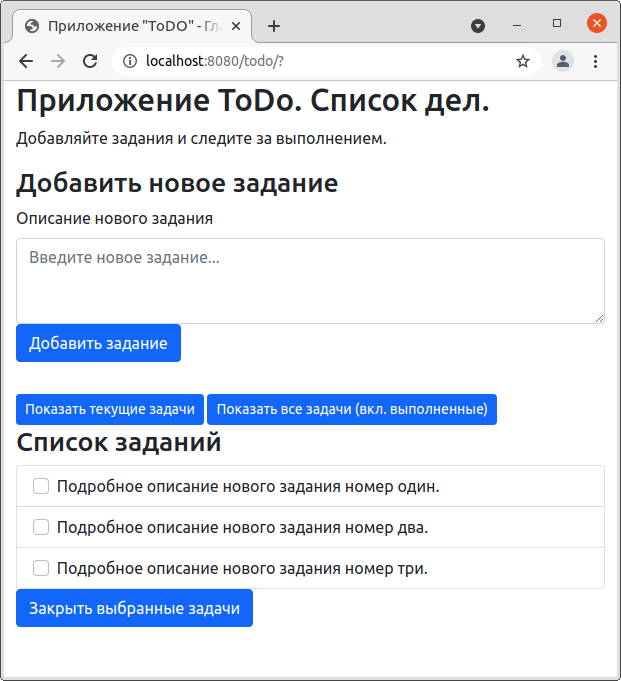
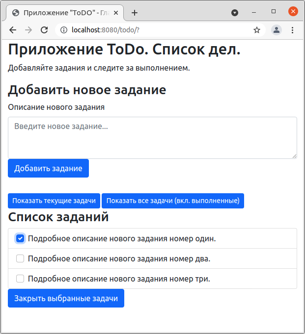
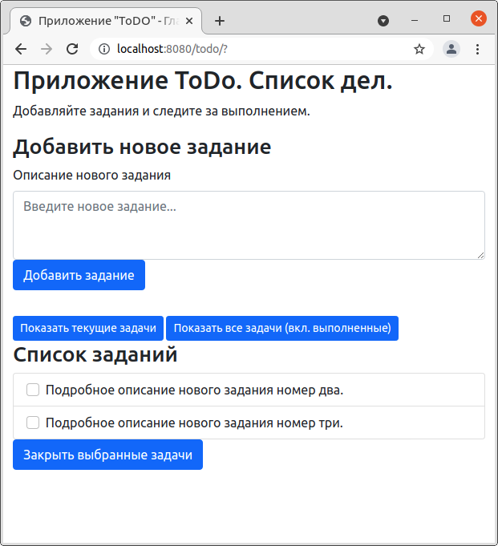
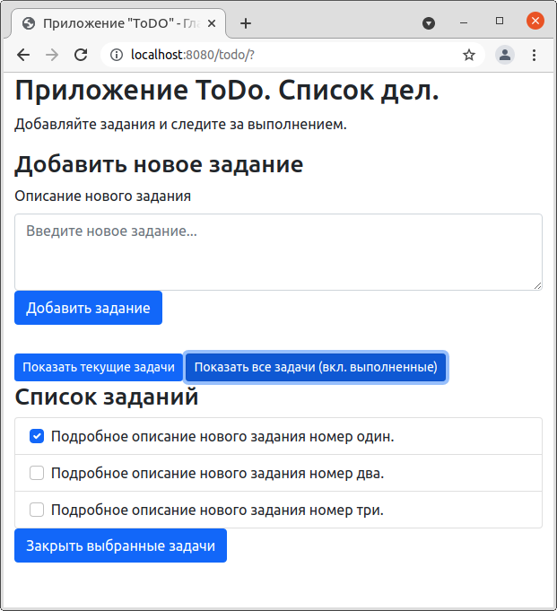

# Приложение ToDo 

## О проекте.
Приложение для отслеживания задач. Составление списка дел. 
Позволяет добавлять задачи в список дел и закрывать их по мере выполнения.

## Сборка 
JDK14, Maven, PostgreSQL, Tomcat
## Как использовать
В верхнее поле вводите текст задачи и нажимаете кнопку "Добавить задание". 
Добавленная задача появится в нижней части приложения.

Чтобы закрыть задачу необходимо, поставить 
галочку рядом с ней и нажать на кнопку "Закрыть выбранные задачи".
Задачи можно закрывать по несколько штук за раз.

Чтобы увидеть список всех задач, в том числе выполненных нажмите на кнопку "Показать все задачи".

## Контакты
Кутявин Владимир

skype: tribuna87

email: tribuna87@mail.ru
