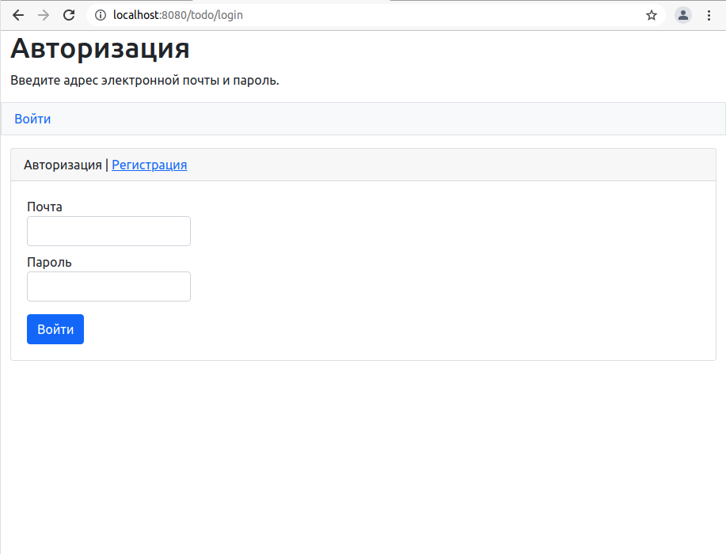
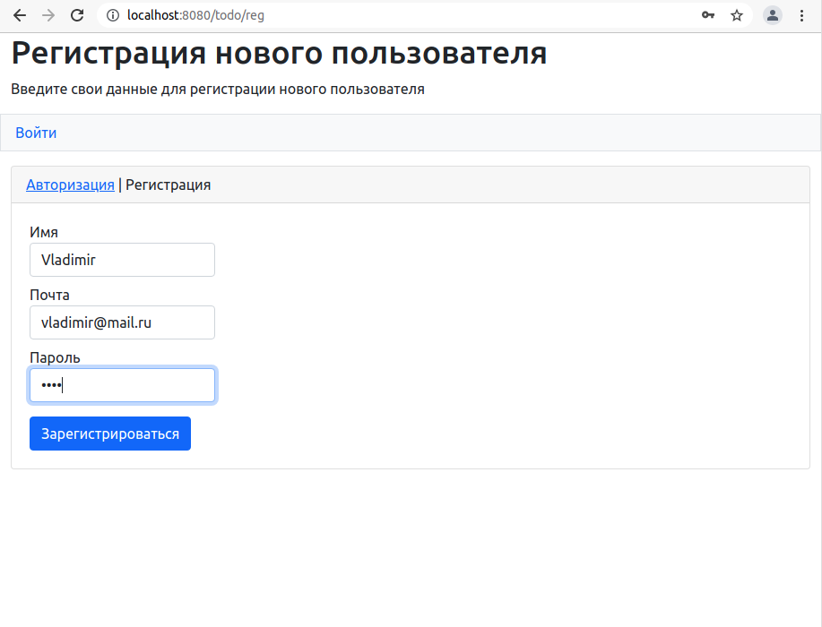
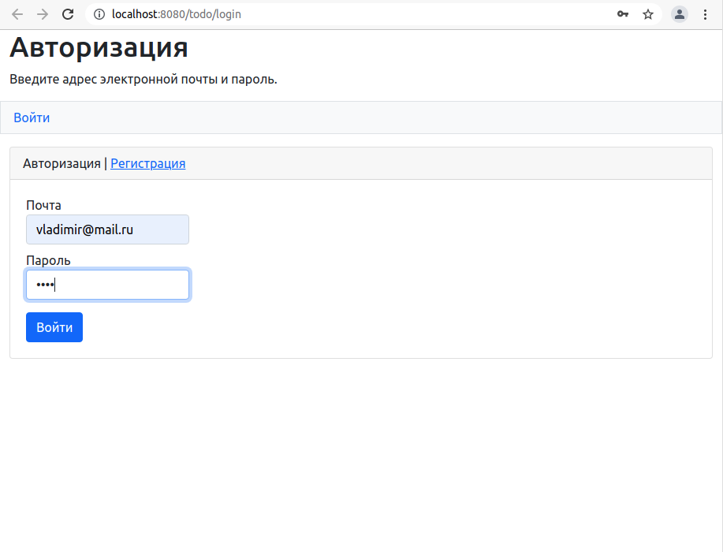
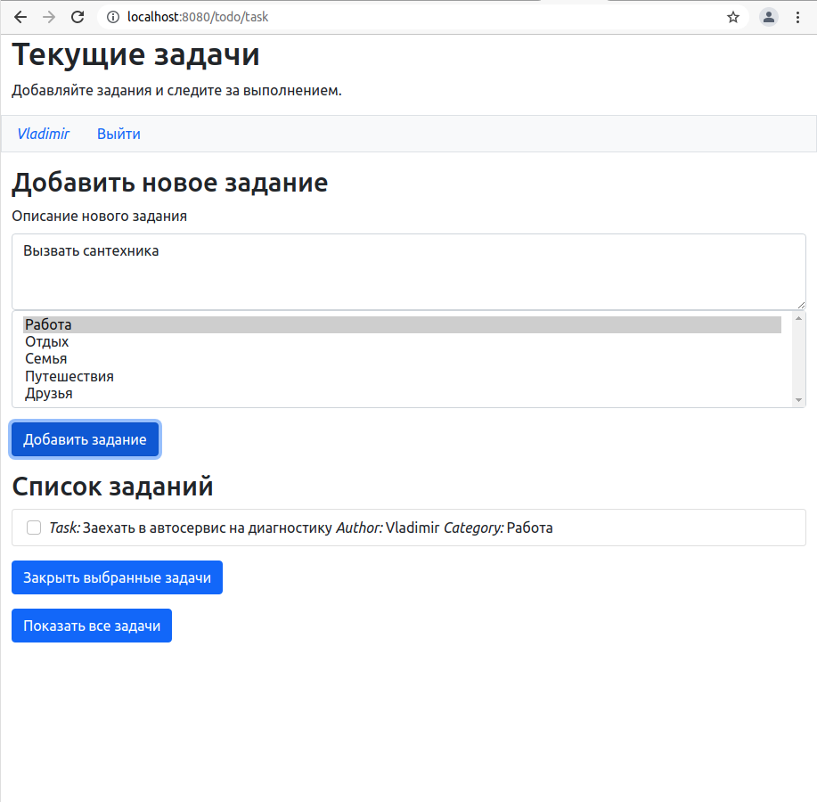
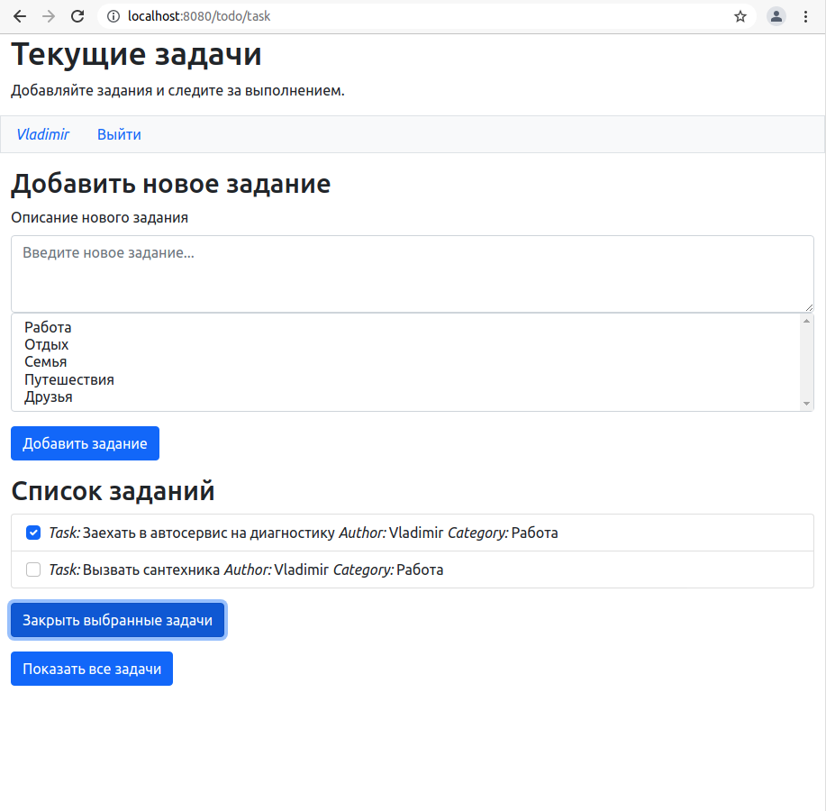
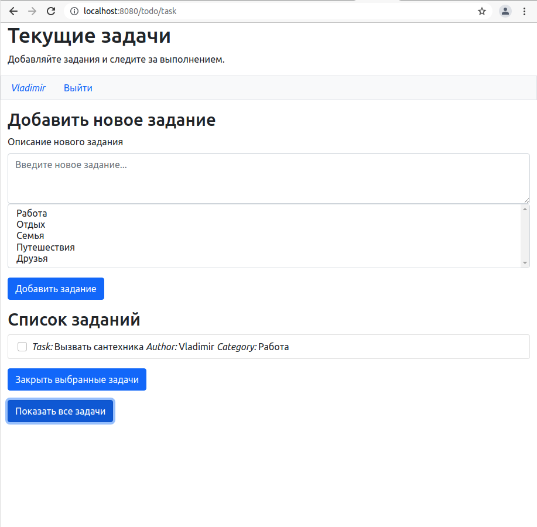
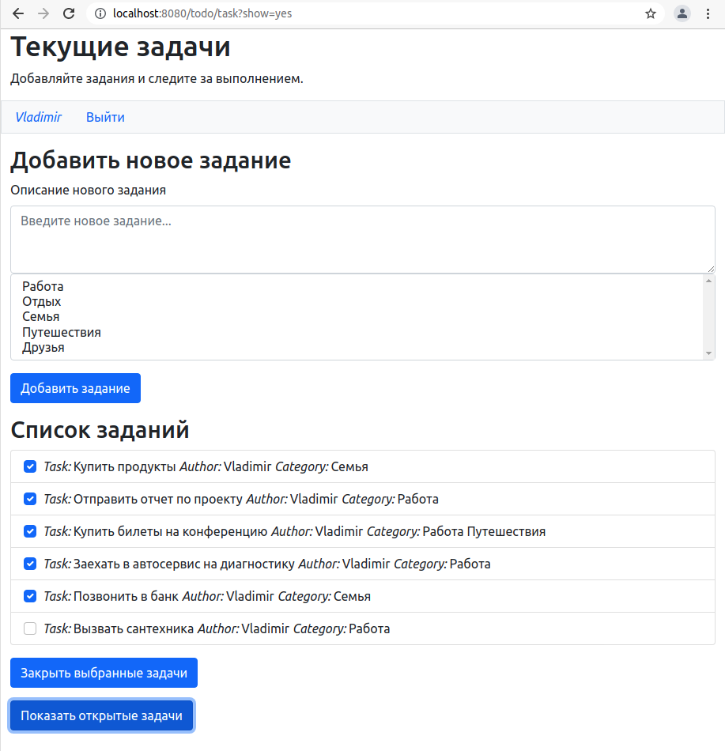

# Приложение ToDo 

## О проекте.
#### Описание
Web-приложения для постановки и отслеживания задач. 
Позволяет составлять списки дел и закрывать их по мере выполнения.
 
#### Технологии
> JDK14, Maven, Java Servlet, HTML, JSP, JSTL, PostgreSQL, Hibernate, Junit

## Сборка 
0. Скачайте исходники 
1. Создайте базу данных в соответствии с настройками, указанными в файле *db.properties*. 
   Файл находится в корневой директории.
2. Выполните сборку проекта: `mvn install`
3. Скопируйте полученный файл *target/job4j_todo-1.0.war* на свой сервер

## Как использовать
Для начала работы в приложении необходимо ввести свои логин и пароль или зарегистрироваться.

Главное окно приложения имеет две основные области: 
"Добавление нового задания" и "Список заданий".

Для добавления нового задания, необходимо в соответствующей области ввести
текст задания и выбрать подходящие категории (можно выбрать несколько) и
нажать на кнопку "Добавить задание"

 
После выполнения одной или нескольких поставленных задач, необходимо 
отметить их как выполненные, поставив галочку
напротив нужной задачи и нажать на кнопку "Закрыть выбранные задачи".

При этом задача исчезнет из списка открытых задач. В любой момент пользователь
может посмотреть список выполненных задач, нажав на кнопку "Показать все задачи".

Чтобы вернуться к просмотру открытых задач, нажмите на кнопку "Показать открытые задачи".

 
## Контакты
Кутявин Владимир

skype: tribuna87

email: tribuna87@mail.ru
